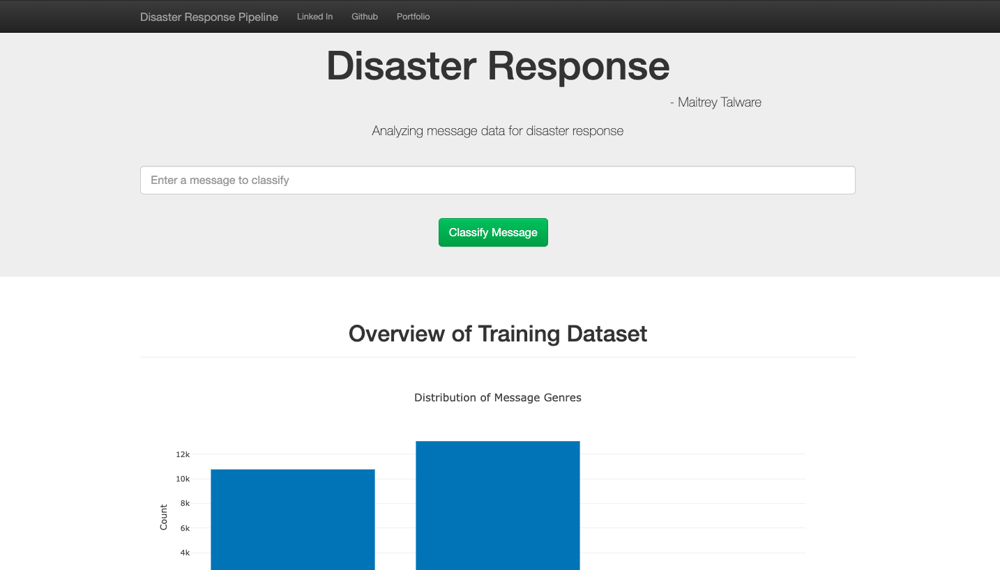
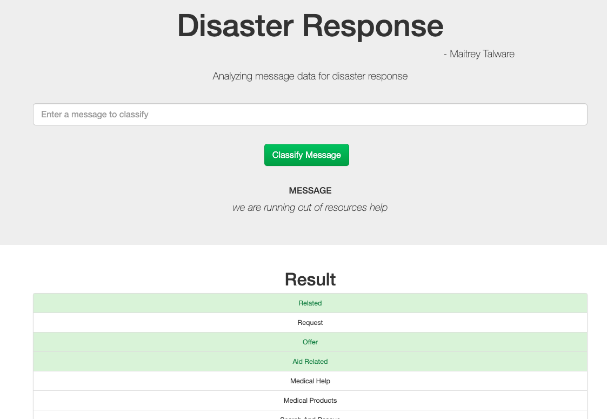
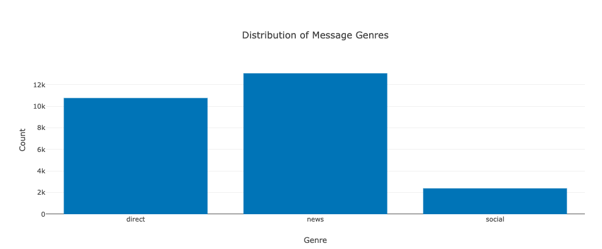
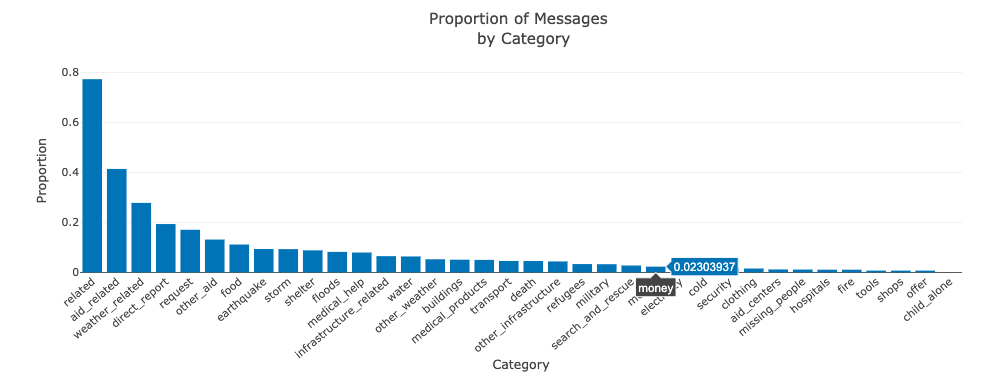

# Disaster Response Pipeline
### Table of contents

<div class="alert alert-block alert-info" style="margin-top: 20px">
    <ol>
        <li><a href="#ref1">Problem Statement </a></li>
        <li><a href="#ref1">Introduction </a></li>
        <li><a href="#ref1">Code Structure</a></li>
        <li><a href="#ref1">Project Components</a></li>
                <ul>
         <li><a href="#ref3">Layout</a></li>
        <li><a href="#ref4">ETL Pipeline</a></li>
        <li><a href="#ref4">ML Pipeline</a></li>
        <li><a href="#ref4">Flask Web App</a></li>
        </ul>
        <li><a href="#ref2">Running the web app</a></li>
        <li><a href="#ref9">Conclusion section</a></li>
        <li><a href="#ref9">References</a></li>
    </ol>
</div>

## 1. Problem Statement
So following a disaster, typically you will get millions and millions of communications either direct or via social media right at the timewhen disaster response organizations have the least capacity to filter and then pull out the messages which are the most important.

When you look at the data,you'll see that these are the categories that we have pulled out for each of these datasets and this is to allow you to investigate the different trends that you might be able to find and to build supervised Machine Learning models.

## 2. Introduction
In this project, we will apply our skills to analyze disaster data from **Figure Eight** to build a model for an API that classifies disaster messages.

We have a data set containing real messages that were sent during disaster events. You will be creating a machine learning pipeline to categorize these events so that you can send the messages to an appropriate disaster relief agency.

Our project will include a web app where an emergency worker can input a new message and get classification results in several categories. The web app will also display visualizations of the data.

## 2. Code Structure
```
.
├── app
│   ├── run.py------------------------# FLASK FILE USED TO RUN THE APP
│   └── templates
│       ├── go.html-------------------# CLASSIFICATION RESULT PAGE OF WEB APP
│       └── master.html---------------# MAIN PAGE OF THE WEB APP
├── data
│   ├── DisasterResponse.db-----------# CLEANED DATABASE
│   ├── disaster_categories.csv-------# DATA TO PROCESS
│   ├── disaster_messages.csv---------# DATA TO PROCESS
│   └── process_data.py---------------# PERFORMS ETL PROCESS
├── Images-------------------------------# PLOTS FOR USE IN README AND THE WEB APP
├── models
│   └── train_classifier.py-----------# PERFORMS CLASSIFICATION TASK
├── ETL Pipeline Preparation.ipynb-----# PREPARING ETL PROCESS
├── ML Pipeline Preparation.ipynb------# PREPARING ML PROCESS
├── Readme.md-------------------------# README FILE

```

## 3. Project Components

#### 1. Layout 
- ETL Pipeline Preparation 
- ML Pipeline Preparation
#### 2. ETL Pipeline
In a Python script, **process_data.py**, write a data cleaning pipeline that:

- Loads the **messages** and **categories** datasets
- Merges the two datasets
- Cleans the data
- Stores it in a SQLite database

#### 3. Machine Learning Pipeline
In a Python script, **train_classifier.py**, write a machine learning pipeline that:

- Loads data from the SQLite database
- Splits the dataset into training and test sets
- Builds a text processing and machine learning pipeline
- Trains and tunes a model using GridSearchCV
- Outputs results on the test set
- Exports the final model as a pickle file

#### 4. Flask Web App
We are providing much of the flask web app for you, but feel free to add extra features depending on your knowledge of flask, html, css and javascript. For this part, you'll need to:

- Modify file paths for database and model as needed
- Add data visualizations using Plotly in the web app. One example is provided for you

#### Before query
</img>
<br></br>

#### After query
</img>
<br></br>

#### Visualisation 1 : 
Showing distribution of Message Genres
</img>
<br></br>

#### Visualisation 2 : 
Showing proportion of Message by Category
</img>
<br></br>

## 4. Running the web app
1. Run the following commands in the project's root directory to set up your database and model.

    - To run ETL pipeline that cleans data and stores in database
        `python data/process_data.py data/disaster_messages.csv data/disaster_categories.csv data/DisasterResponse.db`
    - To run ML pipeline that trains classifier and saves
        `python models/train_classifier.py data/DisasterResponse.db models/classifier.pkl`

2. Run the following command in the app's directory to run your web app.
    `python run.py`

3. Go to http://0.0.0.0:3001/

## 5. Conclusion
We have succesfully implemented a flask web app that classifies disaster messages.

## 6. Reference

- Udacity
- https://scikit-learn.org/stable/modules/generated/sklearn.pipeline.Pipeline.html
- https://scikit-learn.org/stable/modules/generated/sklearn.model_selection.GridSearchCV.html 